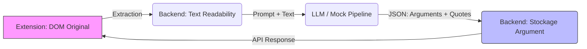

# Documentation du Mécanisme de Liaison (Linking Mechanism)

Ce document explique comment **Hypostasia** relie les arguments générés par l'IA aux portions spécifiques du texte sur la page web originale.

---

## 1. Vue d'ensemble

Le défi principal est de synchroniser deux représentations du même contenu :
1.  **Le DOM Original** (Visualisé par l'utilisateur via l'extension).
2.  **Le Texte Readability** (Utilisé par le LLM pour l'analyse).

Le mécanisme de liaison repose sur l'utilisation de **citations exactes (Exact Quotes)** comme clé de pivot.



---

## 2. Côté Backend (Pipeline IA)

Lorsque le pipeline d'analyse s'exécute (`core/services.py`) :

1.  **Extraction** : Le LLM (ou le Mock) reçoit le texte brut nettoyé (`text_readability`).
2.  **Génération** : Il doit retourner, pour chaque argument, une `text_quote` qui est **une phrase mot-pour-mot** présente dans le texte source.
3.  **Validation** : Le backend vérifie l'existence de cette citation dans `text_readability`.
    *   Si trouvée : Il calcule les `start_offset` et `end_offset` (indices de caractères) pour le stockage base de données.
    *   Si non trouvée : L'argument est rejeté ou marqué comme orphelin (dans le Mock actuel, on saute l'argument).

**Exemple de JSON LLM :**
```json
{
  "text_quote": "L'énergie nucléaire permet une production massive et pilotable.",
  "summary": "Argument sur la stabilité du réseau.",
  "stance": "pour"
}
```

---

## 3. Côté Extension (Frontend Injection)

L'extension reçoit la liste des arguments via l'API. Chaque argument contient `text_original` (la citation).

Pour surligner ce texte sur la page web complexe (qui contient des pubs, des menus, du formatage HTML), nous n'utilisons **PAS** les sélecteurs CSS (trop fragiles) ni les offsets du texte Readability (qui ne correspondent pas au DOM complet).

Nous utilisons une approche de **Recherche Textuelle Cross-Node** (`window.find`) implémentée dans `content.js`.

### Algorithme de Surlignage (`scrollToText`)

1.  **Nettoyage** : On supprime les espaces superflus de la citation cible.
2.  **Recherche Native** : On utilise `window.find(citation, ...)` qui permet au navigateur de chercher le texte tel qu'il est rendu visuellement, ignorant les balises HTML intermédiaires (comme `<b>`, `<a>`, `<span>`).
    *   *Exemple* : La citation "L'énergie nucléaire" sera trouvée même si le HTML est `L'énergie <b>nucléaire</b>`.
3.  **Filtrage** : Si le texte est trouvé dans la Sidebar elle-même (faux positif), on continue la recherche (`findNext`).
4.  **Surlignage** :
    *   Une fois la plage (`Range`) trouvée, on essaie de l'entourer d'un `span.ag-highlight`.
    *   Si le DOM est trop complexe (ex: la sélection chevauche plusieurs blocs non-imbriqués), `surroundContents` peut échouer.
    *   **Fallback** : En cas d'échec, on scrolle simplement vers l'élément parent et on applique un effet visuel temporaire.

---

## 4. Résumé des Clés de Liaison

| Composant | Clé utilisée | Méthode |
| :--- | :--- | :--- |
| **Backend Storage** | Offsets (`start`/`end`) | Calculés sur `text_readability` (stable). |
| **API JSON** | Citation (`text_original`) | Sert de pivot universel. |
| **Extension UI** | Citation (`text_original`) | Recherche dynamique via `window.find()`. |

Cette approche découple le stockage (basé sur le texte pur) du rendu (basé sur le DOM visuel), offrant une grande robustesse face aux variations de formatage HTML.
