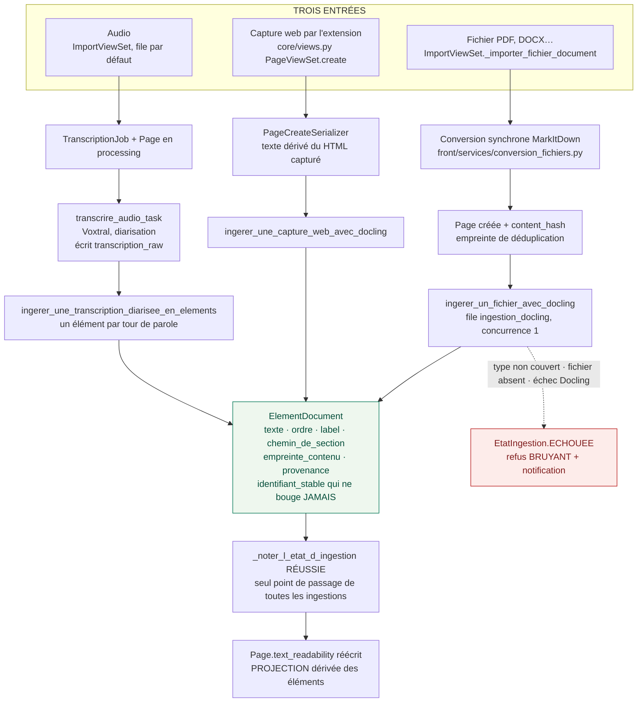
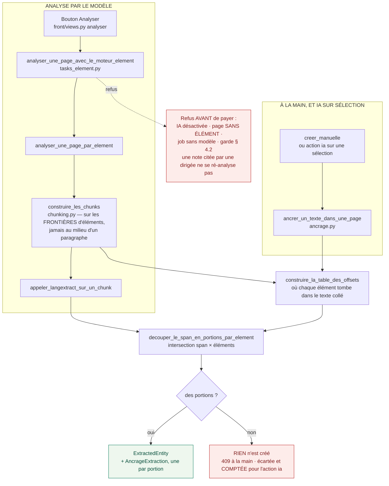
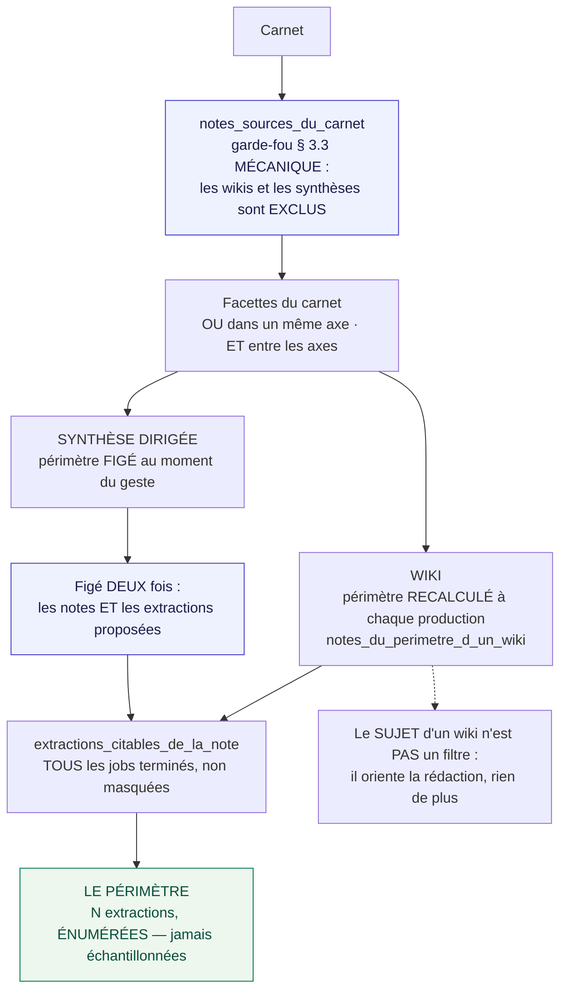

# 1. De l'ingestion au périmètre

> Comment un fichier devient des **preuves citables**, et comment un humain
> décide lesquelles partent au modèle.
>
> Ce que cette planche établit : **rien n'entre dans un périmètre sans être ancré.**

---

## Les trois entrées, et le seul point de sortie

Trois formes d'entrée, trois convertisseurs — mais **un seul aboutissement** :
des `ElementDocument`. Tout ce qui suit ne connaît que ces éléments.

**Le champ plat n'est plus une vérité concurrente.** Il l'a été : l'import de fichier
écrivait un texte par MarkItDown *et* des éléments par Docling — mesuré le 17 août 2026,
une note portait 58 524 signes de texte plat **et** 189 éléments, aux offsets sans rapport.
Depuis, il est **dérivé** des éléments à la réussite de l'ingestion. Il garde ses deux
rôles légitimes — l'empreinte de déduplication, et le repli d'une page sans élément — sans
plus pouvoir mentir.

---

## De l'élément à la preuve : les trois façons de créer une extraction

Une extraction n'est **pas** un bout de texte : c'est un texte **plus ses portions
ancrées**. Les trois chemins passent par la même usine à portions.

**On ne devine jamais.** Un span qui tombe entièrement dans un séparateur de jonction, ou
un texte introuvable dans les éléments, ne produit **aucune** portion — et alors rien n'est
enregistré. Une ancre fausse se donne pour une preuve ; une absence d'ancre non.

> C'est la leçon de l'incident du 13 août 2026 : la création manuelle cherchait sa position
> dans le champ plat, n'y trouvait rien, et retombait sur le caractère 0. **Neuf extractions
> sur douze** pointaient le début du document.

---

## Le périmètre : ce sont des humains qui le décident

Aucune distance sémantique ne choisit. Le périmètre vient du **rangement** — un humain a
classé, un humain filtre.

**Pourquoi le périmètre d'une dirigée est figé deux fois.** Sans le second figeage — les
extractions réellement proposées au modèle — une ré-analyse postérieure réécrirait « ce que
la synthèse n'a pas repris » avec des extractions que l'acte daté n'a **jamais vues**.
C'est-à-dire une réécriture en douce du passé.

**Pourquoi le périmètre s'énumère.** Résumer un groupe par son membre le plus central
efface, mesuré sur l'étalon, **11 extractions sur 19** — et parfois les *deux* faces d'un
désaccord, sans laisser trace qu'il y a eu débat.

---

Planche suivante : [du prompt à l'article sourcé](02-du-prompt-a-l-article-source.md).
