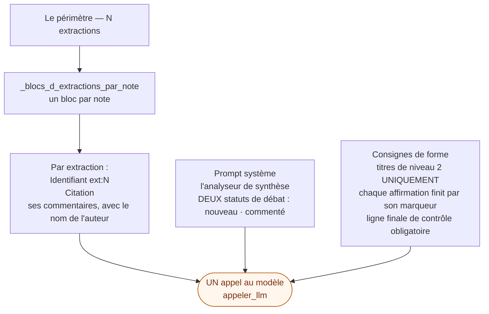
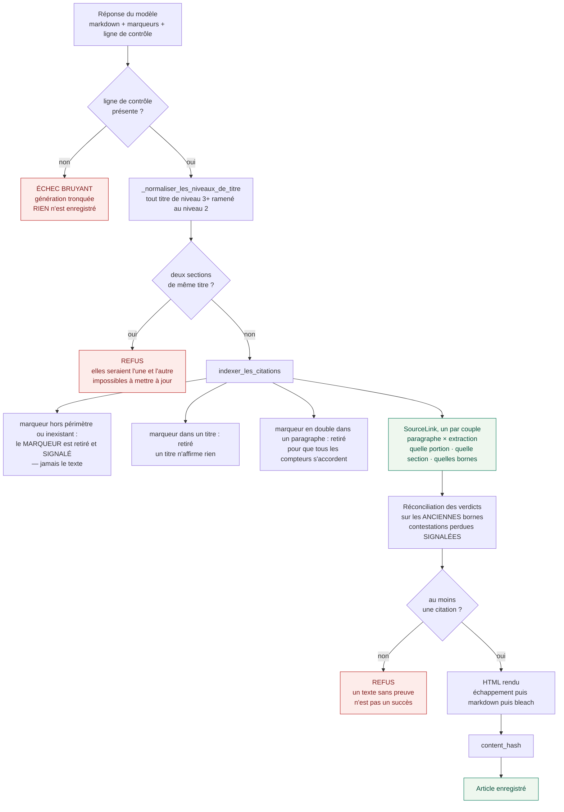
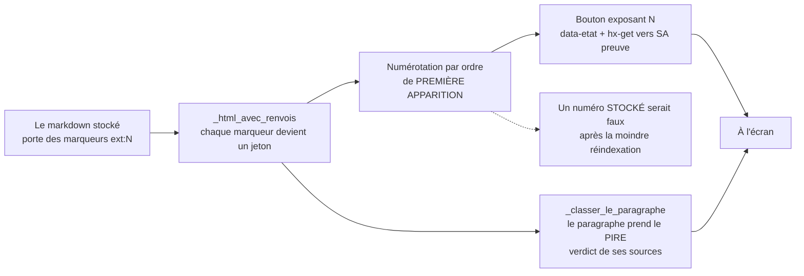
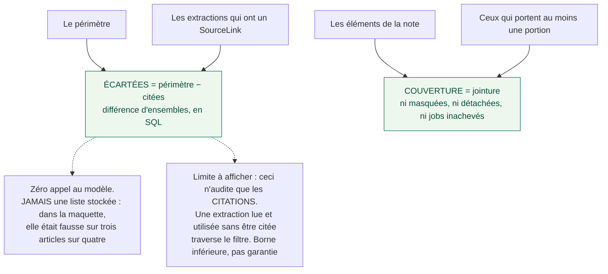
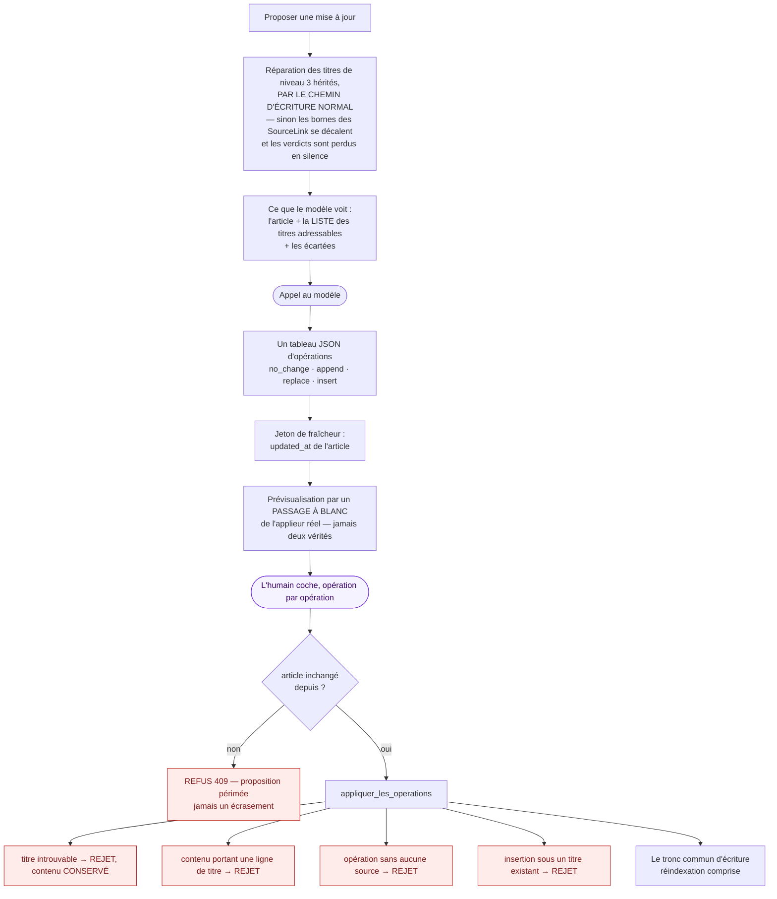

# 2. Du prompt à l'article sourcé

> Un appel au modèle, et un système de sourçage. C'est tout — et c'est ce qui
> permet de remonter d'une phrase à un tour de parole horodaté.
>
> Ce que cette planche établit : **le numéro `[N]` n'est jamais enregistré**, et
> **aucun texte n'est jamais retiré de l'article**.

---

## Ce qui part au modèle

Le prompt ne contient **pas** le texte des notes du carnet. Il contient des **extractions
étiquetées**, avec leurs commentaires.

**On lui demande la chose la plus grossière possible** — *quelle source* — et jamais *où
dans la source*. C'est délibéré : l'état de l'art mesure que contraindre un modèle à citer
plus finement **dégrade** l'attribution de 16 à 276 %. Le grain fin est retrouvé par
jointure, parce qu'il a été payé une fois, à l'extraction.

---

## Du texte rendu à l'article enregistré

**Ce tronc commun sert les TROIS producteurs d'articles** : le wiki, la synthèse dirigée, et
la synthèse d'une note. Le troisième dupliquait sa propre écriture et échappait donc aux
trois gardes — corrigé le 17 août 2026. *Une garde qui ne couvre que deux producteurs sur
trois n'est pas une garde.*

**On ne retire jamais de texte, seulement des marqueurs.** Un paragraphe sans marqueur reste
dans l'article, et s'affiche marqué « non sourcé ». C'est un état des lieux, pas une censure.

---

## À l'affichage : le numéro est attribué, jamais persisté

---

## Deux calculs qui ne coûtent rien

**La couverture sépare deux choses que « non sourcé » confond** : le modèle a inventé, ou
**le passage n'a jamais produit d'extraction**. Sans elle, un trou de couverture se présente
comme une invention potentielle.

---

## La mise à jour d'un wiki : le modèle propose, l'humain accepte

**Les rejets sont par OPÉRATION, jamais par lot** — une hallucination ne jette pas les faits
des autres opérations. Et le contenu rejeté est **conservé et montré** : jamais un
`logger.warning` qui l'avale.

---

Planche suivante : [la vérification des citations](03-la-verification-des-citations.md).
