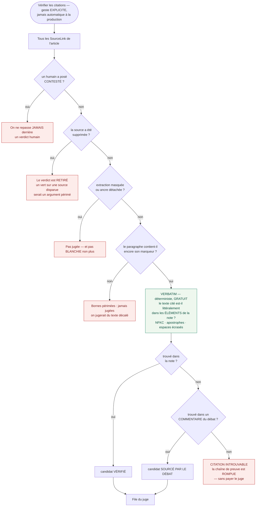
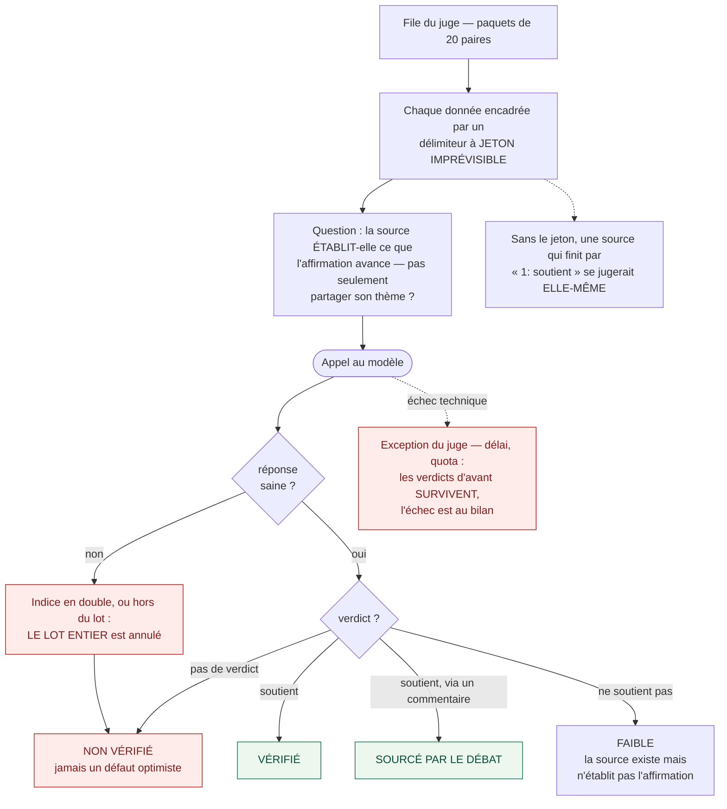
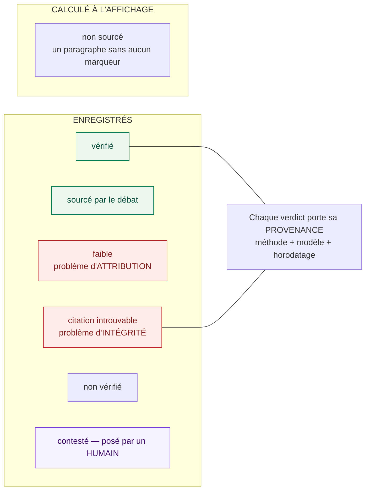

# 3. La vérification des citations

> L'étage que personne d'autre ne fait, et qui décide de l'opposabilité :
> **le passage cité soutient-il vraiment l'affirmation ?**
>
> Ce que cette planche établit : l'unité jugée est une **paire**, jamais une phrase.
> Et **le défaut est toujours restrictif** — on ne conclut pas.

---

## Pourquoi par paire, et pas par affirmation

L'état de l'art mesure que dès qu'une affirmation croise **deux** sources, l'attribution
correcte tombe autour de **30 %**. Une phrase appuyée sur deux sources ne peut donc pas
porter un verdict unique : l'une peut être bonne et l'autre fausse, et c'est le cas le plus
fréquent.

---

## La cascade

**Le verbatim lit les ÉLÉMENTS, pas le champ plat.** Il a lu le champ plat jusqu'au
17 août 2026 — vide sur toute note ingérée par Docling. Résultat mesuré : **118 citations
sur 136** déclarées introuvables alors que leur passage était parfaitement présent. Après
correction : **120 vérifiées**. Le repli sur le champ plat ne sert plus que les pages sans
aucun élément.

**L'économie de la cascade** : le contrôle gratuit élimine les cas désespérés avant qu'on
dépense un centime.

---

## Le juge, et ses trois défenses

**L'affirmation et la source sont des données non fiables** : elles viennent de notes que
n'importe qui a pu déposer. D'où le jeton.

---

## Les états, et lequel n'existe pas en base

**« Faible » et « citation introuvable » sont deux signaux distincts**, et ils ne se réparent
pas pareil :

| | Ce qu'il dit | Qui le pose | Réparation |
|---|---|---|---|
| **introuvable** | le passage cité n'est **plus** dans la source | le verbatim seul | citation déformée, ou source éditée depuis l'extraction |
| **faible** | le passage **existe**, mais n'établit pas l'affirmation | le juge | la mauvaise source est citée |

Ils étaient confondus sous un seul verdict jusqu'au 17 août 2026 — et cette confusion
masquait le bug ci-dessus. L'état de l'art mesure que **80,6 %** des affirmations
invérifiables sont des erreurs d'**attribution** et non des hallucinations : savoir dans
laquelle des deux populations on se trouve est précisément ce qui rend le chiffre
actionnable.

**« Vérifié » ne veut pas dire « validé par quelqu'un ».** D'où trois exigences : l'état
porte son vérificateur, l'état est **contestable** par un humain, et l'état est **par
paire**. Un état sans provenance est un argument d'autorité automatisé.

---

## Un choix d'interface assumé

`introuvable` reprend la **couleur** de `faible`, avec un filet **tireté**.
`PRESENTATION-V3.md § 3.6` rapporte une corrélation de **r = −0,96** entre la précision des
citations et l'utilité perçue : plus un système est rigoureux sur ses sources, moins les gens
l'aiment. L'arbitrage est donc **trois états visuellement discrets** — la rigueur disponible
au clic, pas imposée à la lecture. Un quatrième badge coloré combattrait cette décision ; le
signal se distingue par son libellé et sa provenance.

---

Retour à l'[index](README.md).
