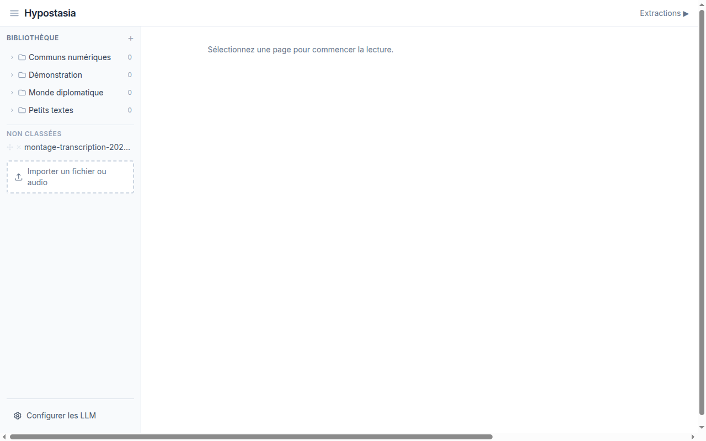

# Prise en main

## L'interface en 3 colonnes

Hypostasia s'organise autour d'une interface a 3 zones :

- **A gauche** : la bibliotheque. Elle contient vos dossiers et vos pages (documents importes). Un bouton `+` permet de creer un nouveau dossier.
- **Au centre** : la zone de lecture. C'est ici que le contenu de la page selectionnee s'affiche.
- **A droite** (masque par defaut) : le panneau d'extractions. Il s'ouvre en cliquant sur le bouton "Extractions" en haut a droite.

## Navigation

- Cliquez sur un dossier dans l'arbre pour le deployer et voir ses pages.
- Cliquez sur le nom d'une page pour l'ouvrir dans la zone de lecture.
- Sur mobile, les panneaux lateraux s'affichent en superposition et se ferment automatiquement apres selection.

## Raccourcis visuels

| Element | Signification |
|---------|---------------|
| Pastille bleue dans le texte | Ancre d'extraction (cliquez pour voir la carte correspondante) |
| Pastille ambre | Extraction commentee |
| Pastille violette | Restitution (lien vers la page source) |
