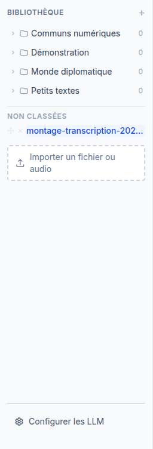
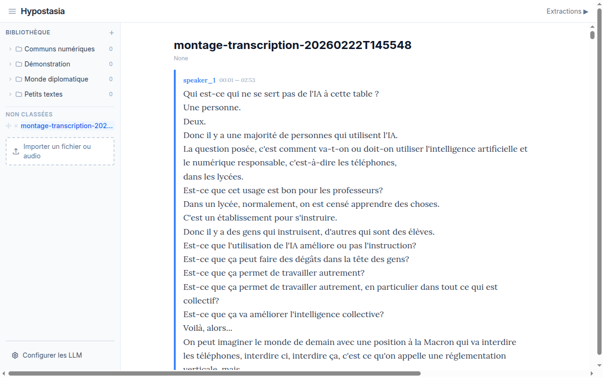

# Import de documents

## Formats acceptes

Hypostasia accepte deux familles de fichiers :

**Documents textuels** : PDF, DOCX, Markdown (.md), texte brut (.txt), PowerPoint (.pptx), Excel (.xlsx), JSON

**Fichiers audio** : MP3, WAV, M4A, OGG, FLAC, WebM, AAC, WMA, Opus, AIFF

La taille maximale est de 50 Mo par fichier.

## Comment importer

1. Dans le panneau gauche, cliquez sur le bouton **"Importer un fichier ou audio"** :

2. Selectionnez votre fichier. Une barre de progression s'affiche pendant l'envoi.

### Import d'un document texte

Le document est converti automatiquement en page lisible. Il apparait immediatement dans la zone de lecture et dans la section "Non classees" de l'arbre.

### Import d'un fichier audio

L'import audio se deroule en deux etapes :

1. **Previsualisation** : Hypostasia affiche un ecran de confirmation avec :
   - Le nom et la taille du fichier
   - Le choix du nombre maximum de locuteurs
   - Le choix de la langue (ou detection automatique)

2. **Transcription** : Apres confirmation, la transcription est lancee en arriere-plan via Celery. Un indicateur de progression s'affiche dans la zone de lecture. La page se met a jour automatiquement quand la transcription est terminee.

Le resultat est une page avec des blocs colores par locuteur, chacun avec ses timestamps :

