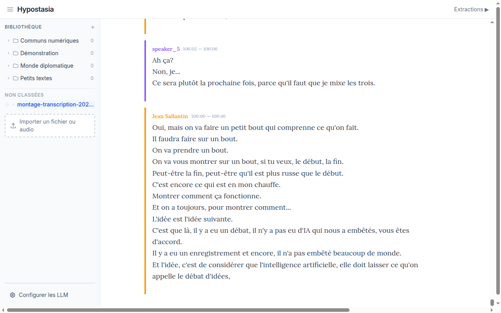
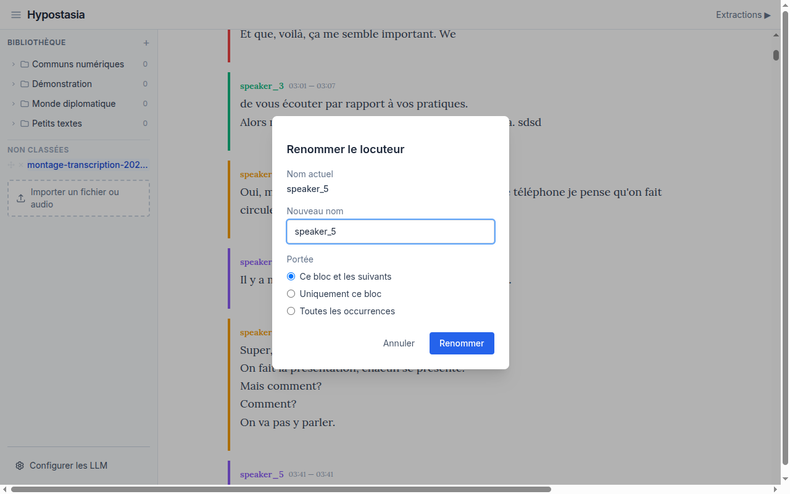
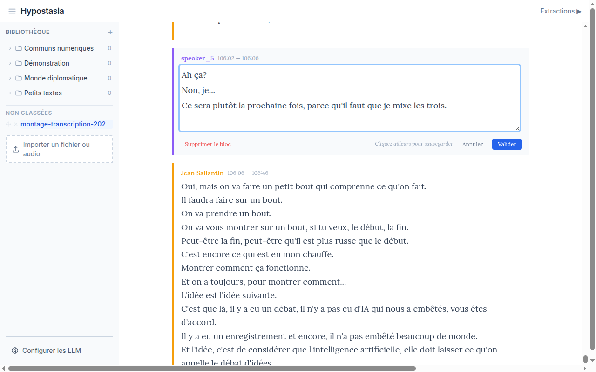

# Edition des transcriptions audio

Apres l'import d'un fichier audio, la transcription affiche des blocs colores par locuteur. Chaque bloc contient le nom du locuteur, les timestamps et le texte transcrit.

## Renommer un locuteur

Les noms attribues automatiquement (speaker_1, speaker_2, etc.) peuvent etre remplaces par les vrais noms des participants.

1. **Cliquez sur le nom du locuteur** (le texte colore en debut de bloc). Un modal s'ouvre :

2. Saisissez le nouveau nom dans le champ "Nouveau nom".

3. Choisissez la **portee** du renommage :
   - **Ce bloc et les suivants** (par defaut) : renomme ce bloc et toutes les occurrences suivantes de ce locuteur. Utile quand un locuteur est identifie a un moment precis de l'enregistrement.
   - **Uniquement ce bloc** : ne renomme que le bloc clique. Utile si la diarisation a mal attribue un seul passage.
   - **Toutes les occurrences** : renomme le locuteur partout dans la transcription.

4. Cliquez sur **"Renommer"** pour valider.

## Modifier le texte d'un bloc

La transcription automatique peut contenir des erreurs. Vous pouvez corriger le texte directement dans la page.

1. **Cliquez sur le texte d'un bloc** (pas sur le nom du locuteur). Le texte se transforme en zone de saisie editable :

2. Modifiez le texte comme vous le souhaitez. Chaque ligne correspond a un segment de la transcription.

3. Pour valider, vous avez trois options :
   - Cliquez sur **"Valider"**
   - **Cliquez n'importe ou en dehors** du champ de texte : la modification est sauvegardee automatiquement
   - **Cliquez sur un autre bloc** : le bloc en cours est sauvegarde, puis le nouveau bloc s'ouvre en edition

4. Pour **annuler** sans sauvegarder, cliquez sur le bouton **"Annuler"**.

> **Astuce** : La sauvegarde automatique au clic exterieur permet d'enchainer les corrections rapidement, bloc apres bloc, sans avoir a cliquer sur "Valider" a chaque fois.

> **Note** : Selectionner du texte dans un bloc (pour creer une extraction manuelle) n'ouvre pas l'editeur. Seul un clic simple sans selection declenche l'edition.

## Supprimer un bloc

Si un bloc est inutile (bruit, silence transcrit, doublon), vous pouvez le supprimer :

1. Cliquez sur le texte du bloc pour passer en mode edition.
2. Cliquez sur **"Supprimer le bloc"** (en rouge, a gauche des boutons).
3. Une boite de confirmation apparait. Validez pour supprimer definitivement le bloc.

La suppression est irreversible : le bloc et ses segments sont retires de la transcription.
